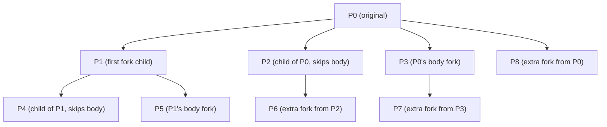

# q1
int main(){

           int r=0;

           pid_t pid = fork();

           if(pid){

                (void) waitpid(pid, &r, 0);

        } else {

                exit(-100);

       }

       printf("r=%d\n", r);

}

guessed still unsure
# q2

int main() { 

	pid_t pid= fork();
	
	if (fork()) { 
		fork(); 
	} 
	if (pid) {
		fork(); 
	} 
}

