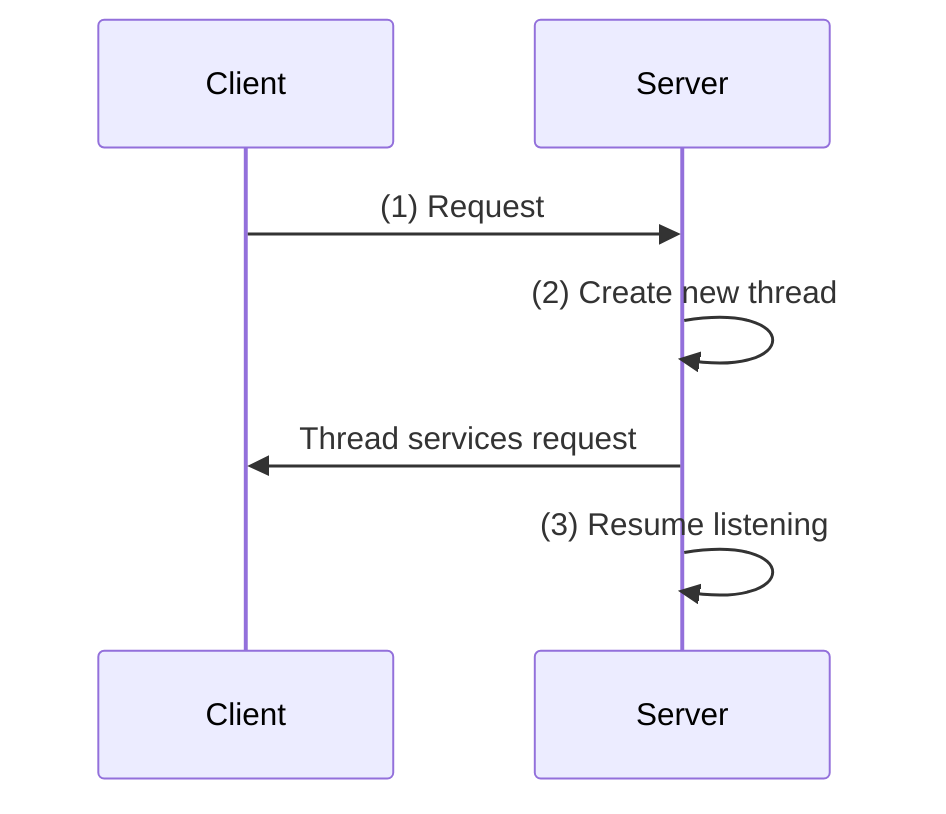
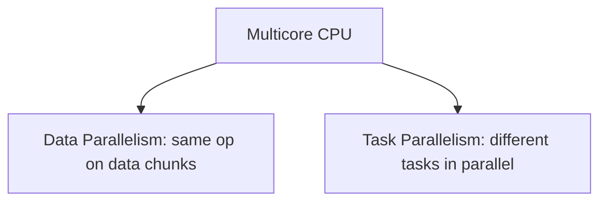
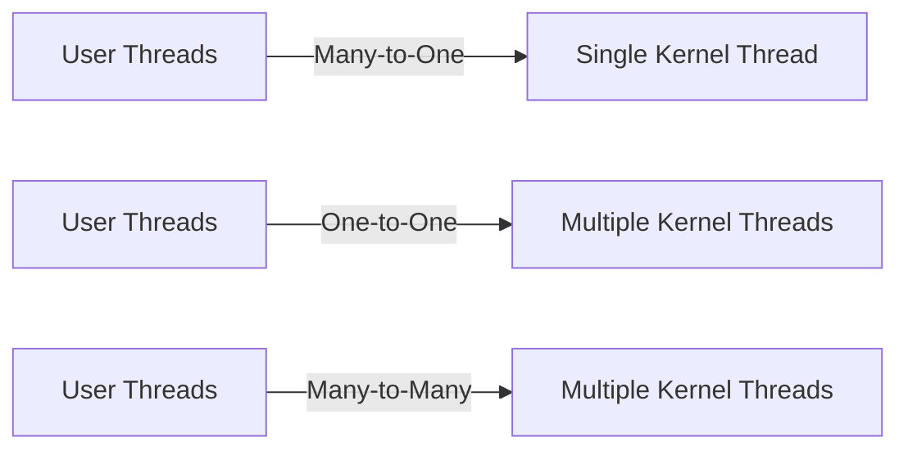

# Chapter 4: Threads

## Overview
- Threads = fundamental unit of CPU utilization.
- Topics covered:
  - Multicore Programming  
  - Multithreading Models  
  - Thread Libraries  
  - Implicit Threading  
  - Threading Issues  
  - OS Examples (Windows, Linux)

---

## Motivation
- Most modern applications are **multithreaded**.  
- Multiple tasks inside the same app can run in separate threads:
  - Update display  
  - Fetch data  
  - Spell-checking  
  - Handle network requests  
- Threads are **lightweight** compared to processes:
  - Process creation = heavy  
  - Thread creation = light  
- Benefits:
  - Simplified code  
  - Increased efficiency  
  - Kernels themselves are multithreaded  

---

## Multithreaded Server Architecture

- Each client request can be serviced by its own thread.
- Improves responsiveness and scalability.
## Benefits of Multithreading
- Responsiveness – UI stays active even if part of process is blocked.
- Resource Sharing – threads share memory and resources.
- Economy – less overhead than processes.
- Scalability – fully utilize multiprocessors.
## Multicore Programming
Challenges:
Dividing activities
Balancing workload
Data splitting & dependencies
Debugging/testing complexity
### Types of parallelism
- Data parallelism – same operation on subsets of data across cores.
- Task parallelism – different operations executed by different threads.

## Concurrency vs Parallelism
Concurrency: multiple tasks make progress on a single core (via scheduling).
Parallelism: tasks run truly simultaneously on multiple cores.
timeline
    title Concurrency vs Parallelism
    section Concurrency
      T1: running
      T2: waiting
      T1: resumed
    section Parallelism
      T1&T2: run simultaneously
      
## Amdahl’s Law
Formula:

Identifies performance gains when adding more cores.  
Serial portion (**S**) heavily affects maximum speedup.

$$
Speedup(N) = \frac{1}{S + \frac{1-S}{N}}
$$

**Example:**  
- If 75% parallel, 25% serial:  
  - 2 cores → ~1.6x speedup  
  - As $N \to \infty$, speedup → $\frac{1}{S}$   

## User vs Kernel Threads
- **User threads**: Managed by user-level libraries (Pthreads, Windows, Java).  
- **Kernel threads**: Supported directly by the OS (Windows, Solaris, Linux, Mac OS X).  

## Multithreading Models

### Many-to-One
- Many user threads → single kernel thread.  
- One block = all blocked.  
- No parallelism.  
- Examples: Solaris Green Threads, GNU Portable Threads.  

### One-to-One
- Each user thread → kernel thread.  
- Better concurrency, but overhead higher.  
- Examples: Windows, Linux, Solaris 9+.  

### Many-to-Many
- Many user threads ↔ many kernel threads.  
- OS manages number of kernel threads.  
- Examples: Solaris (pre-v9), Windows ThreadFiber.  

### Two-Level
- Like M:M, but allows binding user thread to kernel thread.  
- Examples: IRIX, HP-UX, Solaris 8.  

