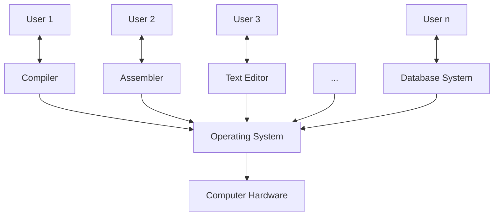
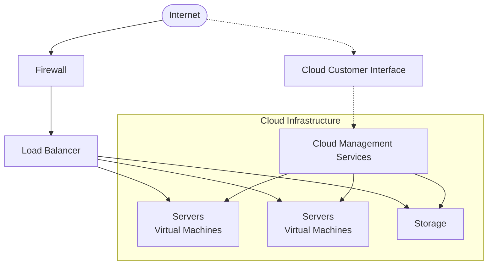

# Chapter 1 - Introduction
## Operating System
- Resource Allocator - manages resources
- Control Program - ctrls exec to prevent errors and use
## Computer System Structure
- Hardware
- Operating System
	- Controls and coordinates use of hardware among various applications and users 
- Application Programs
	- Word processors, compilers, web browsers, database systems, video games
- Users
Diagram Description Hierarchy
Hardware/OS/System/application program/ users

### Computer System Organization
## Computer Startup
- Bootstrap Program - loaded at power-up/reboot
	- stored in ROM (read-only memory) or EPROM (erasable progammable ROM)(firmware)
	- Software but it's firm (not erasable)
### Computer System Operation
- I/O & CPU can execute concurrently
- Device controller has local buffer
- CPU moves data from/to main mem to/from local buffers
- I/O is from device to local buffer of controller
- Controller informs CPU finished operation by interrupt
### Common Functions of Interrupts
- TRAP -> software-generated interrupt
- interrupt vector -> contain all addresses of all services routines (table of all interrupt error addresses)
## Storage Hierarchy
- Speed
- Cost
- Volatility
### Storage-Device Hierarchy
- Registers <-> Cache <-> Main memory <-> ssd <-> hdd <-> optical disk <-> magnetic tape
## Systemic Multiprocessing Architecture
CPU0 --- CPU1 --- CPU2
registers <---> cache for each cpu and then --> memory

## OS operations
- Interrupt Driven
	- Software
		- Exceptions or Traps
	- Hardware
- Dual-Mode (user & Kernel)
	- Mode bit (prov. by hardware)
	- Some instructions *privileged*, only exec in kernel mode
	- System call changes to user, return from call resets to user
## Process Management
- Program is passive entity/Process is active entity
## I/O Subsystem
Character Devices (like pipes: data flows through in order)
- keyboards, mice, serial ports, printers.
Block Devices (transfer data in fixed size blocks)
- Hard drives, SSDs, USB storage, CD/DVD drives.
## Computing Environments
### Client-Server
### Distributed
### Virtualization
- Traditional System Layers
	- Hardware -> Kernel -> Processes
- Virtual System Layers
	- Hardware -> Virtual Machine Manager (Hypervisor) -> Vm1/2/3 -> Kernel (for each VM) -> Processes (under each VM)
### Cloud Computing
- public cloud, private cloud, hybrid cloud
- SaaS (apps via web; ex. word processor), PaaS (Software stack ready for application use via web; ex. DB server), IaaS (storage available for backup use)
- infrastructure

# Chapter 2 - Operating System Structure