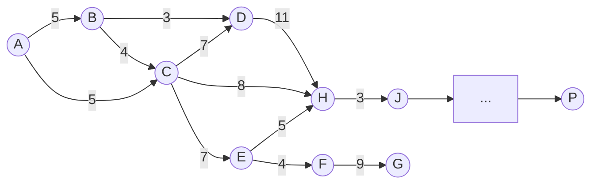

# Review of Graph Theory
## Graphs and Matrices

#### Laplacian Matrices 
- -> Graph and/or adjacency matrix -> Graph

## Review

- Laplacian/Adjacency/Diagonal Matrices
	- Properties:
		- Symmetry 
			- if the graph is undirected I is symmetric
		- Row and Column Sums Zero
			- each Row/Column sums to zero 
				- If this is the case, one of our eigenvalues must be zero
		- Positive semidefinite
			-All eigenvalues >= 0
		- Sparsity
			- If the graph is sparse, I is sparse too
- Eigenvalues/vectors/spaces
### Example - Triangle Graph -> Cyclic
- Degree Matrix
	-     $$
    \begin{array}{lcr}
    2 & 0 & 0 \\
    0 & 2 & 0 \\
    0 & 0 & 2
    \end{array}
    $$

- Adjacency Matrix
	-     $$
    \begin{array}{lcr}
    0 & 1 & 1 \\
    1 & 0 & 1 \\
    1 & 1 & 0
    \end{array}
    $$

- Laplacian
	-     $$
    \begin{array}{lcr}
    2 & -1 & -1 \\
    -1 & 2 & -1 \\
    -1 & -1 & 2
    \end{array}
    $$

## A* Algorithm
### Pseudocode:

~~~
function reconstruct_path(cameFrom, current)
    total_path := {current}
    while current in cameFrom.Keys:
        current := cameFrom[current]
        total_path.prepend(current)
    return total_path

// A* finds a path from start to goal.
// h is the heuristic function. h(n) estimates the cost to reach goal from node n.
function A_Star(start, goal, h)
    // The set of discovered nodes that may need to be (re-)expanded.
    // Initially, only the start node is known.
    // This is usually implemented as a min-heap or priority queue rather than a hash-set.
    openSet := {start}

    // For node n, cameFrom[n] is the node immediately preceding it on the cheapest path from the start
    // to n currently known.
    cameFrom := an empty map

    // For node n, gScore[n] is the currently known cost of the cheapest path from start to n.
    gScore := map with default value of Infinity
    gScore[start] := 0

    // For node n, fScore[n] := gScore[n] + h(n). fScore[n] represents our current best guess as to
    // how cheap a path could be from start to finish if it goes through n.
    fScore := map with default value of Infinity
    fScore[start] := h(start)

    while openSet is not empty
        // This operation can occur in O(Log(N)) time if openSet is a min-heap or a priority queue
        current := the node in openSet having the lowest fScore[] value
        if current = goal
            return reconstruct_path(cameFrom, current)

        openSet.Remove(current)
        for each neighbor of current
            // d(current,neighbor) is the weight of the edge from current to neighbor
            // tentative_gScore is the distance from start to the neighbor through current
            tentative_gScore := gScore[current] + d(current, neighbor)
            if tentative_gScore < gScore[neighbor]
                // This path to neighbor is better than any previous one. Record it!
                cameFrom[neighbor] := current
                gScore[neighbor] := tentative_gScore
                fScore[neighbor] := tentative_gScore + h(neighbor)
                if neighbor not in openSet
                    openSet.add(neighbor)

    // Open set is empty but goal was never reached
    return failure
~~~

### Example of A*

| Node/Vertex | distance | heuristic | g = d + h | g = d + h (letter-wise) |                    |
| ----------- | -------- | --------- | --------- | ----------------------- | ------------------ |
| A           | 0 (A-A)  | 16 (A-P)  | 16        | A-A+A-P                 | A-P                |
| B           | 5 (A-B)  | 17 (B-P)  | 22        | A-B+B-P                 | therefore A-P      |
| C           | 5 (A-C)  | 13 (C-P)  | 18        | A-C+C-P                 | therefore also A-P |
| D           | 12       | 16 (D-P)  | 28        |                         |                    |
| E           | 12       | 16        | 28        |                         |                    |
| F           |          | 20        |           |                         |                    |
| G           |          | 17        |           |                         |                    |
| H           | 13       | 11        | 24        |                         |                    |
| ...         |          | ...       |           |                         |                    |
| ...         |          | ...       |           |                         |                    |
| P           |          | ...       |           |                         |                    |
### Open and Closed Lists
- Think of open lists as frontiers of expansion
- We start with x0 and expand neighbors until we reach xG
	- A*: expand frontier that our heuristic says will lead to minimum cost path
	- Dijkstra: expand frontier that is closest to x0
### What is a good heuristic?
- 

