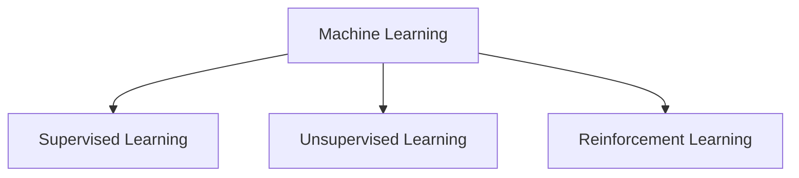
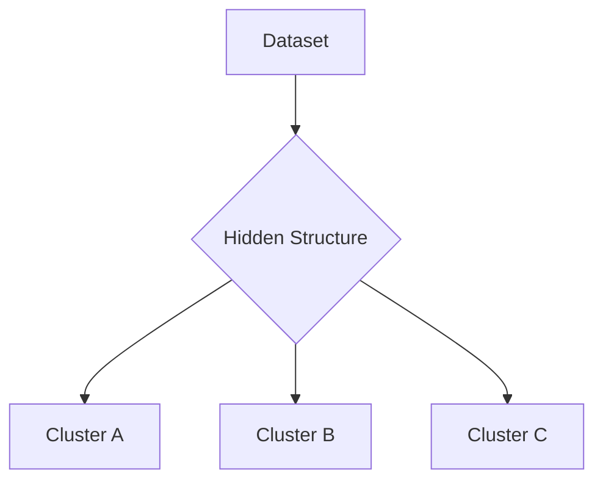
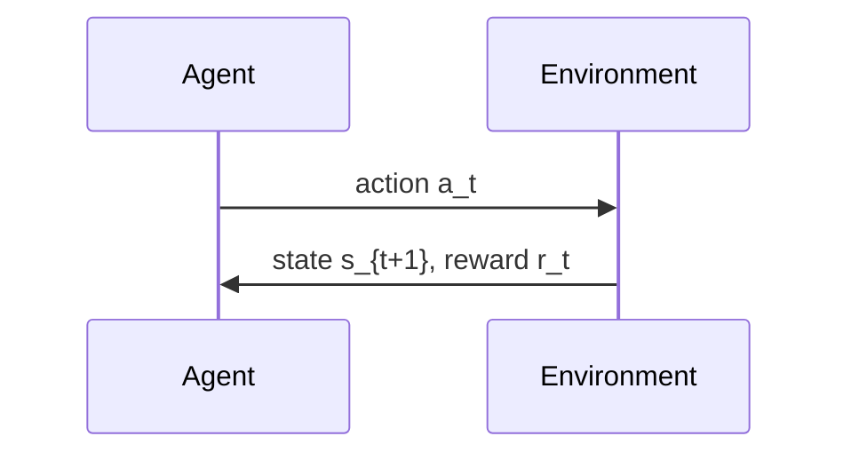

# Introduction to Machine Learning

## What is Machine Learning
• Arthur Samuel  
  • ML lets computers learn without explicit programming  
• Herbert Simon  
  • Learning is improvement over time  
• Tom Mitchell  
  • A system learns from experience E  
  • On tasks T  
  • Measured by performance P  
  • If performance improves with more experience  

### Mitchell example
• Experience: previous games  
• Task: winning  
• Performance: win rate  

## Categories of Machine Learning

## Supervised Learning
• Uses labeled data (x, y)  
• Goal: learn function  
\[
h_\theta(x) = \theta^T x
\]

### Training set
\[
\{(x^{(i)}, y^{(i)})\}_{i=1}^{n}
\]

### Types
• Regression  
  • Predict continuous values  
• Classification  
  • Predict discrete categories  

### Examples
• House price prediction  
  • Single feature  
    \[
    (x^{(i)}, y^{(i)})
    \]  
  • Multi feature  
    \[
    x^{(i)} = (x_1^{(i)}, x_2^{(i)})
    \]  
  • High dimensional  
    \[
    x \in \mathbb{R}^d
    \]

• Computer vision  
  • Image classification  
  • Object detection  

• NLP  
  • Machine translation  

## Unsupervised Learning
• No labels  
• Goal: discover patterns or structure  
• Methods include:  
  • Clustering  
  • Dimensionality reduction  
  • Density modeling  

### Clustering Diagram

## Latent Semantic Analysis
• Reveals hidden structure in text  
• Reduces dimensionality of document term space  

## Word Embeddings
• Represent words as vectors  
• Semantically similar words have similar vector positions  

## Software 2.0
• Neural networks replace manual rule writing  
• Data becomes the behavioral source code  
• Advantages: flexible, scalable, powerful  
• Challenges: debugging and interpretability  

## Introduction to Reinforcement Learning
• Agent interacts with an environment  
• Observes state s  
• Takes action a  
• Receives reward r  
• Learns a policy π(a | s)

### Interaction Loop

## RL Objective Functions

### Return
\[
J(\pi) = \mathbb{E}\left[\sum_{t=0}^{\infty} \gamma^t r_t\right]
\]

### Value function
\[
V^\pi(s) = \mathbb{E}\left[\sum \gamma^t r_t \mid s_0=s\right]
\]

### Action value function
\[
Q^\pi(s,a) = \mathbb{E}\left[\sum \gamma^t r_t \mid s_0=s, a_0=a\right]
\]

## Optimization Methods Used in ML

### LMS cost
\[
J(\theta) = \frac{1}{2m}\sum (h_\theta(x^{(i)}) - y^{(i)})^2
\]

### Gradient descent
\[
\theta_j := \theta_j - \alpha \frac{\partial J}{\partial \theta_j}
\]

### Stochastic gradient descent
\[
\theta_j := \theta_j - \alpha (h_\theta(x^{(i)}) - y^{(i)}) x_j^{(i)}
\]

### Mini batch
\[
\theta := \theta - \alpha \frac{1}{b}\sum_{i \in B} \nabla J^{(i)}(\theta)
\]

### Normal equation
\[
\theta = (X^T X)^{-1} X^T y
\]

### Newton’s method
\[
\theta := \theta - H^{-1} \nabla J(\theta)
\]

## Model Assessment

### Bias variance relation
\[
Error = Bias^2 + Variance + Noise
\]

### Error metrics
• MSE  
\[
\frac{1}{n}\sum (y - \hat{y})^2
\]

• RMSE  
\[
\sqrt{MSE}
\]

• MAE  
\[
\frac{1}{n}\sum |y - \hat{y}|
\]
