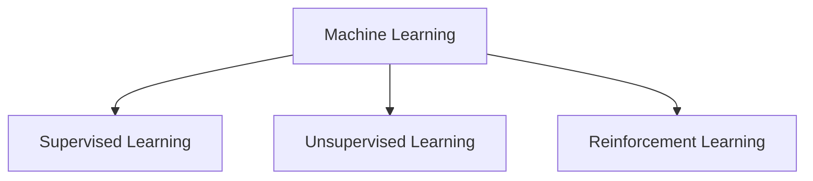
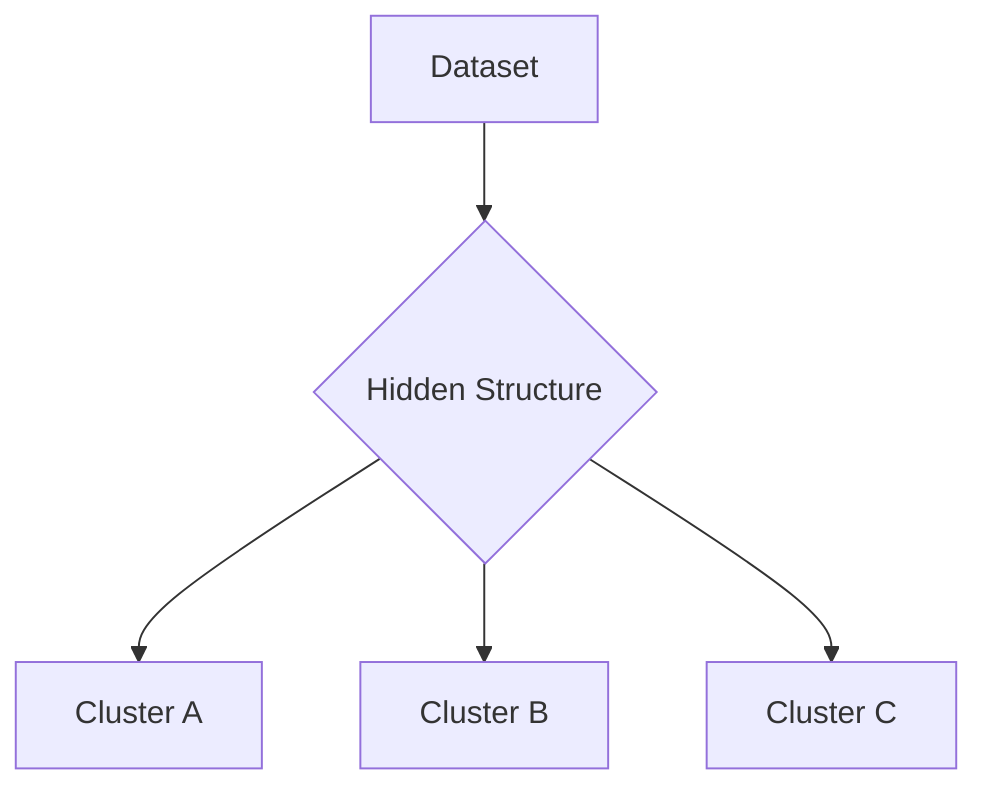

# Introduction to Machine Learning

## What is Machine Learning
• Arthur Samuel  
  • ML lets computers learn without explicit programming  
• Herbert Simon  
  • Learning is improvement over time  
• Tom Mitchell  
  • A system learns from experience E  
  • On tasks T  
  • Measured by performance P  
  • If performance improves with more experience  

### Mitchell example
• Experience: previous games  
• Task: winning  
• Performance: win rate  

## Categories of Machine Learning

## Supervised Learning
• Uses labeled data (x, y)  
• Goal: learn function  
\[
h_\theta(x) = \theta^T x
\]

### Training set
\[
\{(x^{(i)}, y^{(i)})\}_{i=1}^{n}
\]

### Types
• Regression  
  • Predict continuous values  
• Classification  
  • Predict discrete categories  

### Examples
• House price prediction  
  • Single feature  
    \[
    (x^{(i)}, y^{(i)})
    \]  
  • Multi feature  
    \[
    x^{(i)} = (x_1^{(i)}, x_2^{(i)})
    \]  
  • High dimensional  
    \[
    x \in \mathbb{R}^d
    \]

• Computer vision  
  • Image classification  
  • Object detection  

• NLP  
  • Machine translation  

## Unsupervised Learning
• No labels  
• Goal: discover patterns or structure  
• Methods include:  
  • Clustering  
  • Dimensionality reduction  
  • Density modeling  

### Clustering Diagram

