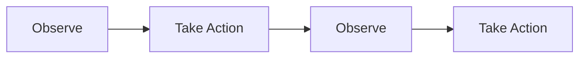
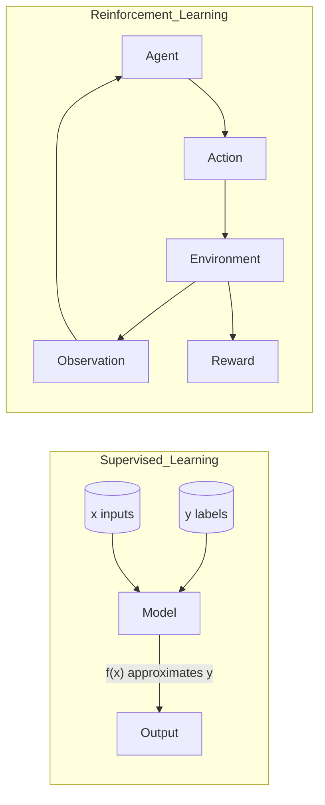
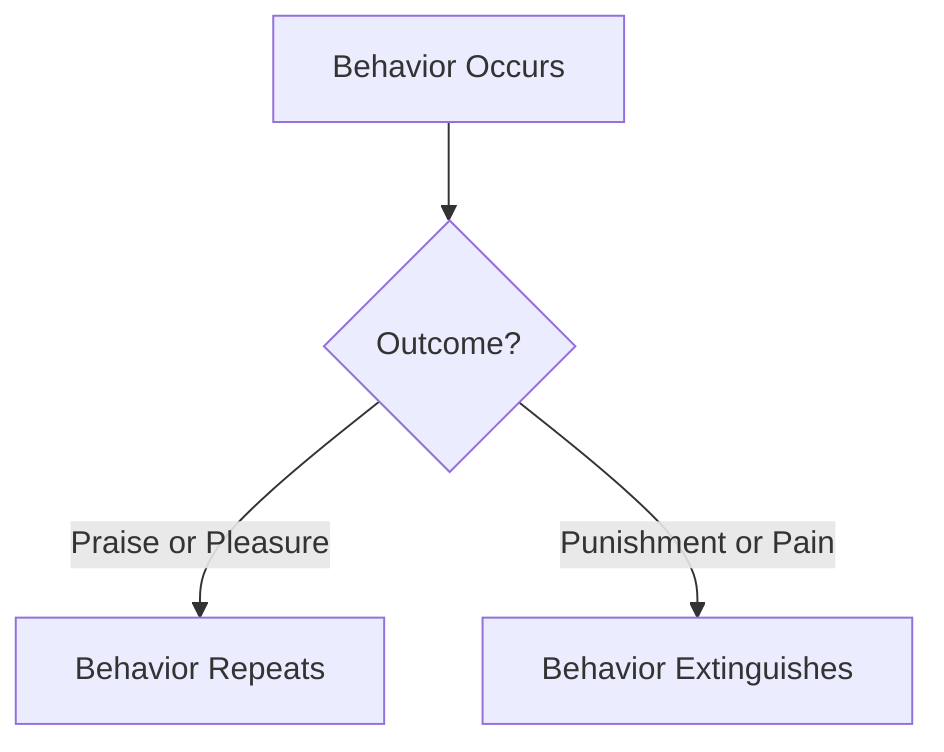
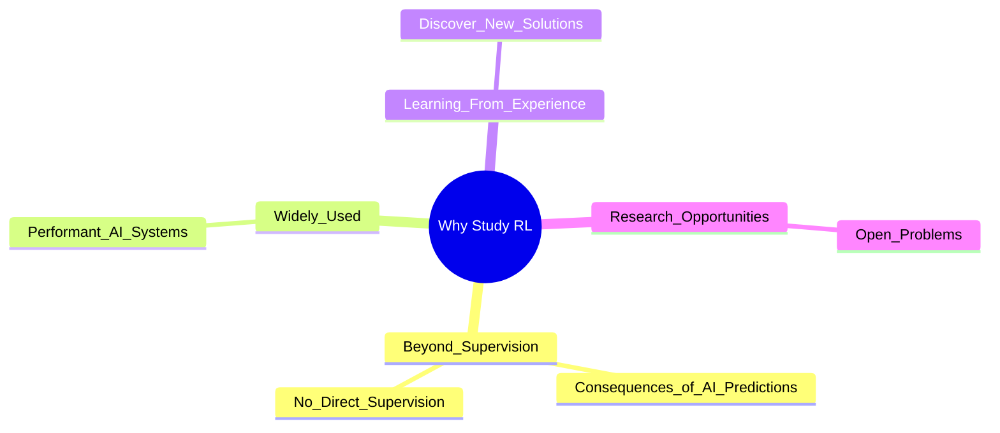
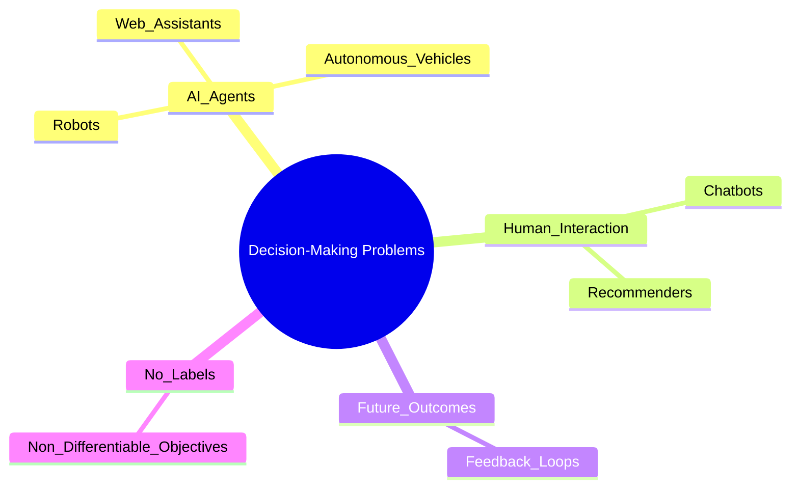
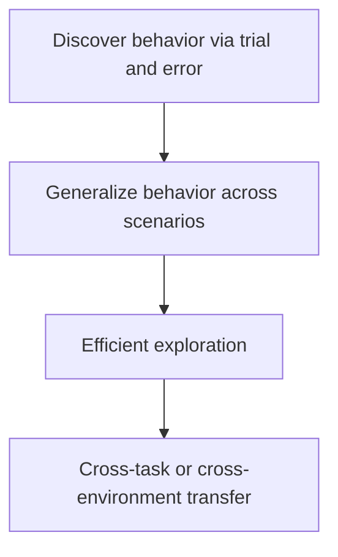
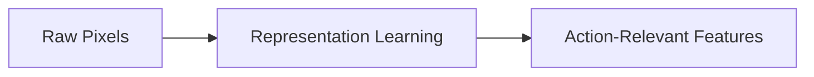

# CMPE 260 Reinforcement Learning  
## Introduction to Reinforcement Learning

## Key Learning Goals
- What deep reinforcement learning is  
- How to represent behavior  
- How to formulate a reinforcement learning problem

## Meaning of Deep Reinforcement Learning
- Sequential decision making problems  

  - Systems make multiple decisions from a stream of observations  
  - Observe, act, observe, act  
- Solutions include:  
  - Imitation learning  
  - Model free and model based RL  
  - Offline and online RL  
  - Multi task and meta RL  
  - RL for LLMs  
  - RL for robots  
- Emphasis on methods that scale to deep neural networks

## Machine Learning vs Reinforcement Learning

- Supervised learning  
  - Given labeled pairs  
  - Direct supervision  
  - Inputs i.i.d.  
- Reinforcement learning  
  - Learn a behavior policy  
  - Feedback comes indirectly from experience  
  - Data is not i.i.d. because actions affect future observations  
- Behaviors include motor control, chatbots, game playing, driving, web agents

## Shaping of Behavior

- Behavior shaped by reinforcement rather than free will  
- Behaviors followed by praise or pleasure tend to repeat  
- Behaviors followed by punishment or pain tend to extinguish

## Why Study Reinforcement Learning

- Move beyond supervised (x, y) examples  
- Useful when direct supervision is unavailable  
- Fundamental for building AI that learns from experience  
- RL can discover new solutions  
- Many open research problems

## Why Study Deep Reinforcement Learning

- Decision making problems are common across agents, robots, vehicles, assistants  
- Useful when interacting with people  
- Necessary when actions influence future observations  
- Useful when labels are unavailable or objective is not just accuracy  
- Enables complex physical tasks  
- Enables complex game playing and novel strategies  
- Modern LLMs use RL in post training  
- Useful for generative image model alignment  
- Used in chip design optimization  
- Supports scaling to large systems and advanced reasoning

## Research Challenges in Deep RL
- Teaching robots good or bad actions (reward learning)  
- Generalizing behaviors to new scenarios  
- Scaling methods to large datasets and tasks  
- Using RL for long horizon tasks  
- Practicing tasks autonomously (reset free RL)

## Representation Learning
- Convert raw observations into feature representations  
- Helps transform pixels into action relevant structures  
- Remember what the computer actually sees  
- Auxiliary tasks can reduce interaction cost  
  - Examples: object detection, image classification, pixel labeling, instance discrimination

## Observation to State Mapping
- Requires significant domain knowledge  
- Visual input must be converted to structured state information

## Learning to Act

- Discovering behavior through trial and error with rewards  
- Generalizing behavior across viewpoints, objects, and scenarios  
- Generalization is key for efficient exploration  
- Representation learning enables transfer across tasks and environments

## Leveraging Pretrained Models
- Vision language action models (RT 2)  
- Pretrained models can generalize better with fewer interactions  
- Useful for complex robotic control tasks

## How to Build Intelligent Machines
- Learning is central to intelligence  
- Deep reinforcement learning provides a framework for building learning agents  
- Evidence supports deep learning as effective for perception and decision making  
- Many challenges remain in control, exploration, generalization, safety, and scaling

## Modeling Behavior in Reinforcement Learning
- Represent experience as data  
- Distinguish between state and observation  
- Understand how to map observations to states  
- Learn policies with neural networks

## Goal of Reinforcement Learning
- Learn a behavior policy that maximizes cumulative reward  
- Use stochastic policies to improve exploration and performance  
- Define objectives around long term rewards, not single actions

## Types of Algorithms
- Many algorithmic families exist due to differing problem assumptions  
- Choosing an algorithm depends on data availability, model structure, and task type

## AI’s Paradox
- Some tasks that are easy for humans are hard for AI  
- Some tasks that are hard for humans are easy for AI  
- Explained through differences in evolution and cognitive development  
- Observations from infant learning provide insights

## Summary and Recap
- Reviewed definitions of RL components  
- Reinforcement learning uses interaction, reward, and sequential decisions  
- Deep RL scales RL methods with neural networks  
- Final slide: Thank you
