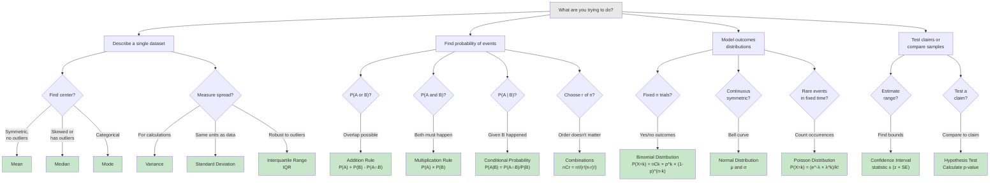

```mermaid
graph TD
    Start["What are you trying to do?"]
    
    Start --> Describe["Describe a single dataset"]
    Start --> Probability["Find probability of events"]
    Start --> Distribution["Model outcomes<br/>distributions"]
    Start --> Inference["Test claims or<br/>compare samples"]
    
    Describe --> Center{"Find center?"}
    Describe --> Spread{"Measure spread?"}
    
    Center -->|Symmetric,<br/>no outliers| Mean["Mean"]
    Center -->|Skewed or<br/>has outliers| Median["Median"]
    Center -->|Categorical| Mode["Mode"]
    
    Spread -->|For calculations| Variance["Variance"]
    Spread -->|Same units as data| StdDev["Standard Deviation"]
    Spread -->|Robust to outliers| IQR["Interquartile Range<br/>IQR"]
    
    Probability --> AddSub{"P(A or B)?"}
    Probability --> Mult{"P(A and B)?"}
    Probability --> Cond{"P(A | B)?"}
    Probability --> Comb{"Choose r of n?"}
    
    AddSub -->|Overlap possible| Addition["Addition Rule<br/>P(A) + P(B) - P(A∩B)"]
    Mult -->|Both must happen| Multiplication["Multiplication Rule<br/>P(A) × P(B)"]
    Cond -->|Given B happened| Conditional["Conditional Probability<br/>P(A|B) = P(A∩B)/P(B)"]
    Comb -->|Order doesn't matter| Combinations["Combinations<br/>nCr = n!/(r!(n-r)!)"]
    
    Distribution --> Trials{"Fixed n trials?"}
    Distribution --> Continuous{"Continuous<br/>symmetric?"}
    Distribution --> Rare{"Rare events<br/>in fixed time?"}
    
    Trials -->|Yes/no outcomes| Binomial["Binomial Distribution<br/>P(X=k) = nCk × p^k × (1-p)^(n-k)"]
    Continuous -->|Bell curve| Normal["Normal Distribution<br/>μ and σ"]
    Rare -->|Count occurrences| Poisson["Poisson Distribution<br/>P(X=k) = (e^-λ × λ^k)/k!"]
    
    Inference --> Estimate{"Estimate<br/>range?"}
    Inference --> Test{"Test a<br/>claim?"}
    
    Estimate -->|Find bounds| ConfInt["Confidence Interval<br/>statistic ± (z × SE)"]
    Test -->|Compare to claim| HypTest["Hypothesis Test<br/>Calculate p-value"]
    
    style Start fill:#e8e8e8
    style Mean fill:#c8e6c9
    style Median fill:#c8e6c9
    style Mode fill:#c8e6c9
    style Variance fill:#c8e6c9
    style StdDev fill:#c8e6c9
    style IQR fill:#c8e6c9
    style Addition fill:#c8e6c9
    style Multiplication fill:#c8e6c9
    style Conditional fill:#c8e6c9
    style Combinations fill:#c8e6c9
    style Binomial fill:#c8e6c9
    style Normal fill:#c8e6c9
    style Poisson fill:#c8e6c9
    style ConfInt fill:#c8e6c9
    style HypTest fill:#c8e6c9
```
```